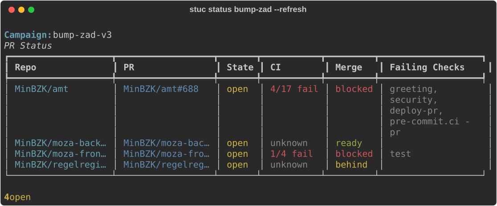

# stuc

Plaster the same fix across all your repos.

`stuc` discovers matching files via `gh search code`, previews diffs, then clones repos, applies changes, and opens PRs. It works as a four-step pipeline: define a campaign, preview what would change, apply it, and track the resulting PRs. Supports both regex find-and-replace and LLM-powered transformations via `claude`.

<p align="center">
  
</p>

## Why?

Maintaining dozens (or hundreds) of repos in a GitHub org means you regularly need to update the same pattern everywhere -- bumping a shared action version, renaming an import path, rotating a config value. Doing that by hand is tedious and error-prone. `stuc` turns it into a single command. For changes that need context (refactoring, adding sections, applying guidelines), the LLM mode delegates transformation to `claude`.

## Installation

Requires Python 3.11+ and the [GitHub CLI](https://cli.github.com/) (`gh`), authenticated with access to the target orgs.

```bash
# Install from GitHub
uv tool install git+https://github.com/RijksICTGilde/stuc.git
```

For development:

```bash
git clone https://github.com/RijksICTGilde/stuc.git
cd stuc
uv sync
uv run stuc --help
```

## Quick start

### Regex mode (default)

```bash
# 1. Create a campaign
stuc init bump-actions \
  --org MyOrg \
  --file-glob ".github/workflows/*.yml" \
  --find "MyOrg/my-action@v1" \
  --replace "MyOrg/my-action@v2" \
  --branch "stuc/bump-actions" \
  --commit-msg "chore: bump my-action to v2" \
  --pr-title "Bump my-action to v2"

# 2. Preview what would change (read-only)
stuc plan bump-actions

# 3. Apply changes (clones repos, pushes branches, opens PRs)
stuc apply bump-actions

# 4. Track PR and CI status
stuc status bump-actions --refresh
```

### LLM mode

When a change needs context-awareness rather than a fixed pattern, use `--mode llm` with a prompt instead of regex:

```bash
stuc init add-license \
  --mode llm \
  --org MyOrg \
  --file-glob "*.md" \
  --search-term "README" \
  --prompt "Add a EUPL-1.2 license section at the end of the file" \
  --branch "stuc/add-license" \
  --commit-msg "docs: add license section" \
  --pr-title "Add license section to README"

stuc plan add-license    # preview LLM-generated diffs
stuc apply add-license   # apply and open PRs
```

Optional flags for LLM mode:
- `--context-file <path>` -- include a reference document (style guide, spec) in the LLM prompt
- `--validation <cmd>` -- shell command to validate each transformed file during `apply`

## Commands

| Command | What it does |
|---------|-------------|
| `stuc init <name> ...` | Create a campaign definition (saved to `~/.stuc/campaigns/<name>.yml`) |
| `stuc list` | List all campaigns |
| `stuc plan <name>` | Preview matching files and diffs without making changes |
| `stuc apply <name>` | Clone repos, apply changes, push branches, open PRs |
| `stuc apply <name> --dry-run` | Show what `apply` would do without touching anything |
| `stuc apply <name> --auto-merge` | Apply and enable auto-merge on created PRs |
| `stuc status <name> --refresh` | Fetch current PR state and CI results |
| `stuc status <name> --auto-merge` | Enable auto-merge on open PRs with passing CI |
| `stuc delete <name> --yes` | Remove a campaign file (does not close existing PRs) |

## How it works

1. **init** saves a campaign definition as YAML in `~/.stuc/campaigns/`. In regex mode the definition includes the find/replace pattern; in LLM mode it stores the prompt and search term. Both modes share target orgs, file glob, and PR metadata.

2. **plan** uses `gh search code` to find files across the target orgs, fetches their content via the GitHub API, applies the transformation (regex or LLM), and shows a colored diff. Nothing is modified.

3. **apply** re-discovers matching files, clones each affected repo into a temp directory, creates a branch, applies the transformation, commits, pushes, and opens a PR. Repos that already have an open PR on the campaign branch are skipped. PR URLs are saved back to the campaign file.

4. **status** queries GitHub for the state of every PR in the campaign: open/merged/closed, CI check results, and merge status. With `--auto-merge`, it enables squash auto-merge on PRs where all checks pass.

LLM mode calls `claude -p` for each file, so `plan` is slower than regex mode. The output is non-deterministic: diffs at plan time show the direction of the change, but `apply` may produce slightly different results. Review the plan carefully before applying.

## Regex patterns

The `--find` argument accepts Python regex syntax, including capture groups. Use backreferences in `--replace`:

```bash
stuc init migrate-import \
  --org MyOrg \
  --file-glob "**/*.py" \
  --find "from oldpackage\\.([a-z]+) import" \
  --replace "from newpackage.\\1 import" \
  --branch "stuc/migrate-import" \
  --commit-msg "refactor: migrate oldpackage to newpackage" \
  --pr-title "Migrate oldpackage imports"
```

GitHub's code search doesn't support regex, so `stuc` extracts the longest literal substring from your pattern to use as a search query. The full regex is then applied locally against each file's content.

## Excluding repos

Skip specific repos with `--exclude-repo`:

```bash
stuc init my-campaign \
  --org MyOrg \
  --exclude-repo MyOrg/legacy-repo \
  --exclude-repo MyOrg/archived-thing \
  ...
```

## Prerequisites

- [GitHub CLI](https://cli.github.com/) installed and authenticated (`gh auth status`)
- Push access to target repos (for creating branches and PRs)
- Python 3.11+
- For LLM mode: the [`claude` CLI](https://claude.ai/code)

## Development

```bash
# Install dev dependencies
uv sync

# Run tests
uv run pytest

# Run a single test
uv run pytest tests/test_discover.py::test_extract_search_term_simple
```

## License

[EUPL-1.2](LICENSE)
